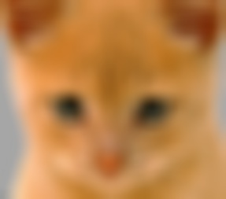

<html>
<head>
<title>Computer Vision Project</title>
<link href='http://fonts.googleapis.com/css?family=Nunito:300|Crimson+Text|Droid+Sans+Mono' rel='stylesheet' type='text/css'>
<link rel="stylesheet" title="Default" href="styles/github.css">
  

<link rel="stylesheet" href="highlighting/styles/default.css">

</head>
<body>

<h1><B>Farshad Rafiei</B></h1>

<h2><B>Project 1: Image Filtering and Hybrid Images</B></h2>

Hybrid Image

 	Hybrid images are static images which could be interpreted differently as a function of distance. Generally, human eye perceives low frequencies in images when being exposed to it. However, it can perceive the image as it is in smaller distances. The goal of this project, is to extract the low and high frequencies from two different perfectly aligned images and combine them to create hybrid images. For this goal, we implement two functions. First one is called my_imfilter() which simply filters the image with an arbitrary shaped kernel with odd dimensions. It receives the filter and image as inputs, perform 2D convolution on them and returns the filtered image. Second function is named create_hybrid_image() which in turn receives three inputs: two images that should be added up to create the hybrid image and the filter. It creates the hybrid image using my_imfilter() in three steps as following:  

<ol>
<li>Low pass filtering of first image </li>
<li>High pass filtering of second image </li>
<li>Add up two images to create the hybrid image </li>
</ol>

<h3><B>Implementation</B></h3>

 	For implementing my_imfilter(), the input image and the kernel should be convolved. Therefore, the code need to be written in a way which does the convolution in a proper way and preferably be efficient enough to be run in a reasonable amount of time. Since our function need to be compatible with both gray scale and RGB images, we should check for this first. If the input image is gray scale, then the convolution could be done simply by convolving the image with filter. But if the input image is an RGB image, then we need to break the image into R, G and B components and do the convolution on each of these image components separately and finally concatenate them together. To write the convolution, either image or the filter should be flipped with respect to both rows and columns. This code flips the filter for this reason. Then, it takes the pixels of the original image one by one and extracts the neighborhood of that pixel which is compatible (same shape) with the filter. Finally, the corresponding pixel in the filtered image would be the sum of elements in dot product matrix. Before convolution, the original image should be padded to overcome the problem of choosing neighborhood pixels for marginal elements in original image. For this code, reflection is used as padding scheme, since it results in a better filtering performance. 

	Implementation of create_hybrid_image() is a way easier, since it uses my_imfilter() as the big part of creating hybrid images. First of all it filters both of input images with low pass kernel. Then, it subtracts one of the images from its low frequencies to extract the high frequencies out of it. Finally, it adds up two images to build up the final hybrid image. Following shows general idea behind the code for this function:  

<pre><code>
% create_hybrid_image()
  low_frequencies = my_imfilter(image1, filter)
  high_frequencies = image2 - my_imfilter(image2, filter)
  hybrid_image = low_frequencies + high_frequencies

</code></pre>

<h3><B>Validation</B></h3>

 	To confirm whether my_imfilter() function works correctly, results of filtering an image with different kernels including identity filter, box filter, Sobel filter and discrete Laplacian filter is compared with the results of built-in function in python called filter2D in OpenCV. All of the outputs are identical. Following shows identity image, small blurred image, large blurred image, Sobel image and laplacian image respectively from left to right.   

<table border=1>
<tr>
<td>

</td>
</tr>
<table>

<h3><B>Results</B></h3>

 	The figure below shows the low pass filtered image of a dog, high pass filtered image of a cat and the hybrid image in different sizes to simulate the distance between eyes and images. As the images becoming smaller, perception of the image alters from cat to dog. Cut-off frequency to build this hybrid image is set to be 7. In other words, a gaussian filter of length 29x29 is being used with cutoff frequency of 7 pixels to build this hybrid image. In far distances, low frequency contents of an image are perceived and therefore, for this hybrid image, dog should be processed by brain as the image content in the smallest hybrid figure.   

<table border=1>
<tr> 
<td> 

</td>
</tr>
<table>

 	The figure below shows another example of creating hybrid images, but this time for grayscale image. It shows low pass filtered image of Marilyn Monroe, high pass filtered image of Einstein, and the final hybrid image. The big image shows Marilyn Monroe, however, smaller images change the content of perception to Einstein. Cut-off frequency to build this image is set to 4. To create a proper hybrid image, cut-off frequency needs to be chosen in an appropriate way. Choosing random cut-off frequency will not necessarily result in a good hybrid image.   

<table border=1>
<tr>
<td>

</td>
</tr>
</table>

 	Figure below shows another example. This hybrid image is created by setting cut-off frequency equal to 3.   

<table border=1>
<tr>
<td>

</td>
</tr>
</table>

<h3><B>Conclusions</B></h3>

 	A hybrid image is an image that could be perceived in one of two different ways as function of distance. Hybrid images combine low frequencies of an image with high frequencies of another image to create a new image which is interpretable in two different ways by visual system and human brain. Looking at the image in short distance, one can discern the details in the image and therefore the high frequencies are visible. In this case, the image that is undergone high pass filtering would be perceived. As the viewing distance increases, details (high frequency) disappears and only low frequency contents of the image remains as input for human visual system. In this case, low pass filtered image will emerge.

	To create a hybrid image, constitutive images need to be perfectly aligned. Properly chosen cut-off frequency is another essential component in creating a good hybrid image. This cut-off frequency is dependent on the frequencies present in the image. There should be trade off between removal of high frequency and low frequency information from an image. Otherwise, one of images will be dominant and it will be very hard to capture the nature of hybrid image.

	Implementing an efficient low pass filter is the key in creating a hybrid image. Two images must be convolved with a low pass filter to create two images with low frequencies. Then the image with high frequency content can be captured by simply subtracting the original image from low pass filtered image. Adding up two images with different frequency contents results in hybrid image    

