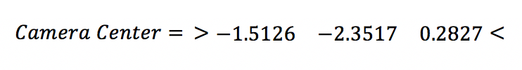
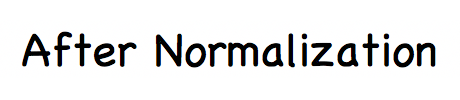
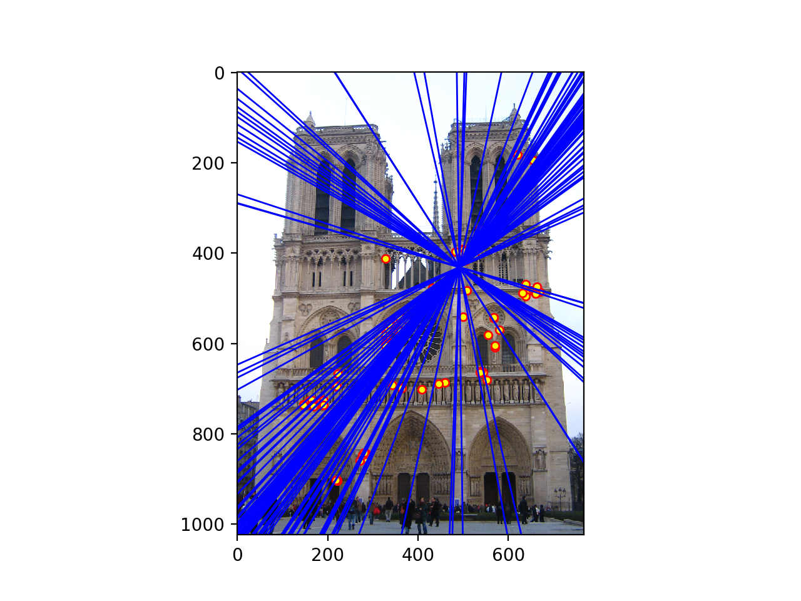
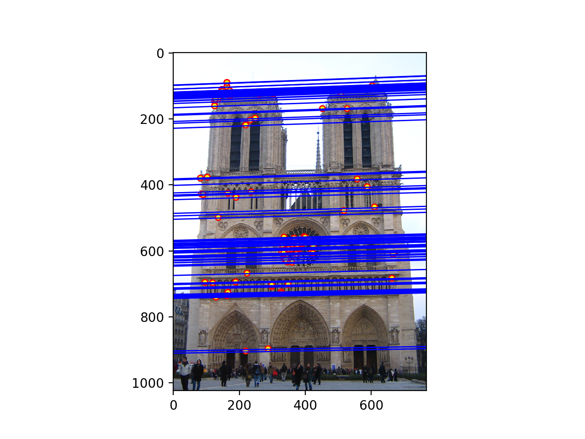

<h2><B> Project 3 / Camera Calibration and Fundamental Matrix Estimation with RANSAC</B></h2>

 	The aim of this project is to examine scene geometry and introduces geometry of points, lines, planes and projections in multi-view geometry. The project contains three major parts. In first part, camera projection matrix will be estimated using corresponding 2D image points and 3D real world points. Finding the location of the camera using projection matrix is the second step in part one. Second part will give an estimation of fundamental matrix which assigns points in one scene to epipolar lines in another scene. This could be done using corresponding 2D points from two different images of a single scene. The last part of the project is similar to part two but different in a way that this part is driven without ground truth. Lots of correspondences will be estimated for an image pair using a descriptor called ORB (Oriented FAST and Rotated BRIEF) and implementing RANSAC will help to choose appropriate correspondences (inliers) in these image pairs.  

<h3><B>Part 1: Camera Projection Matrix</B></h3>

 In this part, ground truth is being provided and we only need to solve for the following equation. Note that ground truth here means that the corresponding 3D world coordinates and 2D image coordinates from a single scene. 	

<table border=0.5>
<tr>
<td>

</td>
</tr>
</table>

 Matrix M is defined up to scale and we need to solve it by setting one of the elements of matrix m to a constant and use linear regression to find the other elements. We set m34 to 1 and find the following projection matrix: 	

<table border=0.5>
<tr>
<td>

</td>
</tr>
</table>

 Now that we have M, we can tease it apart to two matrices one indicating intrinsic parameters and the other one representing extrinsic parameters and from those matrices we could find camera center. The estimated location of the camera is:  	

<table border=0.5>
<tr>
<td>

</td>
</tr>
</table>

 Figure below provides a 3D view of the estimated camera center with respect to normalized 3D point coordinates: 

<table border=0.5>
<tr>
<td>

</td>
</tr>
</table>

<h3><B>Part 2: Fundamental Matrix Estimation</B></h3>

 In this part of the project we are going to estimate a matrix which maps the points in one image to epipolar lines in another image. This is called fundamental matrix and it uses corresponding points in two images from a single scene to solve the following: 

<table border=0.5>
<tr>
<td>

</td>
</tr>
</table>

 Matrix F is defined up to scale and again, like what we did in part 1, we need to solve it by setting one of the elements to a constant and solve for other elements based on linear regression. Least squares estimate of F is full rank, but the fundamental matrix is rank 2 matrix. To solve for this problem, we need to decompose estimated F matrix using singular value decomposition and set the smallest eigenvalue to zero. Multiplying decomposed matrices with new eigenvalue will result in fundamental matrix.  

 To evaluate the performance of estimation, we provide corresponding points in an image pair. Using estimated fundamental matrix we draw epipolar lines in two images. The results are shown in figure below. 

<table border=1>
<tr>
<td>

</td>
</tr>
</table>

 These results seem to be great, but looking at the images in detail, one can realize that some of the epipolar lines are not passing through the center of the points in each image and there is very small error in fundamental matrix estimation. To overcome this issue, we can normalize the coordinates before computing fundamental matrix. Normalization matrix is as following: 

<table border=0.5>
<tr>
<td>

</td>
</tr>
</table>

 c_u and c_v are mean coordinates and s is the scale factor which is standard deviation after subtracting the means for each axis. Results after normalization are as following: 

<table border=1>
<tr>
<td>

</td>
</tr>
</table>

 It's pretty much clear that the normalization make the results more accurate and now epipolar lines pass through center of the points. 

<h3><B>Part 3: Fundamental Matrix with RANSAC</B></h3>

 In this part of the project, real images without any ground truth are used to find fundamental matrix. For this reason, unreliable point correspondences computed by ORB (an alternative to SIFT) are used. We will iteratively choose 9 number of correspondences created by ORB and solve for fundamental matrix using the function from part 2. Then, as an evaluation, number of inliers will be counted and finally the best fundamental matrix with the highest number of inliers will be returned. 

 Results for Mount Rushmore image pair is shown in following: 

<table border=1>
<tr>
<td>

</td>
</tr>
</table>

 As it can be seen from the above images, RANSAC does a relatively great job at finding corresponding points. However, epipolar lines seem to be weird and also there is a noticeable number of outliers in correspondences. Let's look at the results after normalization. 

<table border=1>
<tr>
<td>

</td>
</tr>
</table>

 Obviously, normalization makes the results better by making epipolars more accurate and increasing the number of correspondences in image pairs. 

 Results for Notre Dame image pair before and after normalization are shown below. For this pair, before normalization, number of mismatches are even more and epipolar lines does seem rational at all. However, after normalization results seem perfect and translation of the camera center is reflected by the formation of epipolar lines. 

<table border=1>
<tr>
<td>

</td>
</tr>
</table>

 Results for Episcopal Gaudi and Woodruff Dorm image pairs are shown below both before and after normalization. The same results hold for these pairs and normalization make the outcomes close to perfect with rational drawing of epipolar lines. 

<table border=1>
<tr>
<td>

</td>
</tr>
</table>

<table border=1>
<tr>
<td>

</td>
</tr>
</table>

<h3><B>Conclusions</B></h3>

 In this project, we examined how to use corresponding 3D world coordinates and 2D image coordinates to find the camera projection matrix and camera center. Knowledge of these correspondences can help finding intrinsic and extrinsic parameters in scene geometry. In addition, correspondences in image pairs of a scene can make the computation of fundamental matrix (mapping of points in one image to lines in another image) easier. 	However, this is not always easy to find these correspondences. In last part, a feature descriptor was used to find the corresponding points in two images of a single scene. In this case, there are a lot of outliers and RANSAC is used to estimate the best fundamental matrix. The results were way better than what we get from implementing Harris detector, SIFT descriptor and nearest neighbor ratio matching. Moreover, this method is faster than what we used in last project.

 One very important point from this project is how normalization of initial points or "self-calibration" algorithm could improve the results. Not only normalization improves the performance of finding corresponding points in image pairs, it helps computing the epipolar lines more accurately. From the previous project, we remember that implementing complicated Harris detector, SIFT descriptor and matching algorithms was unable to reach reasonable performances for hard image pairs. However, self-calibration was easy to implement and improved the performance of matching to a great extent. 

</body>
</html>
