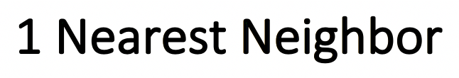
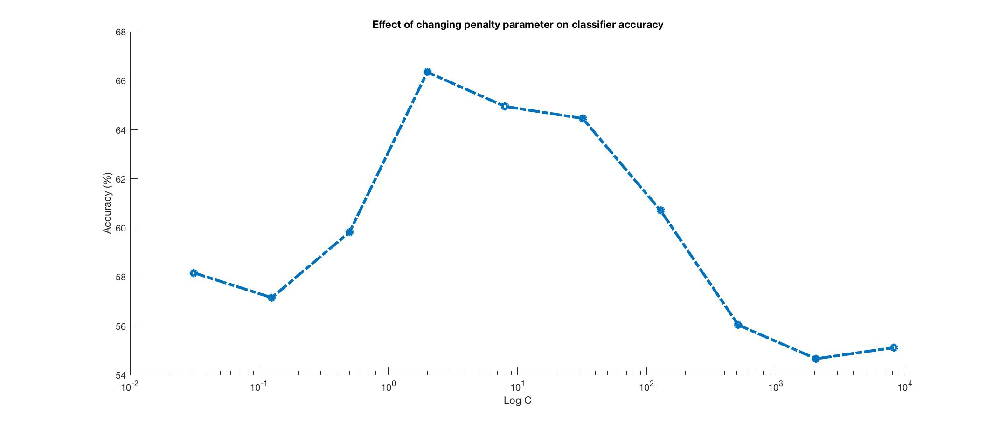

<!-- <html>
<head>
<title>Computer Vision Project</title>
<link href='http://fonts.googleapis.com/css?family=Nunito:300|Crimson+Text|Droid+Sans+Mono' rel='stylesheet' type='text/css'>
<link rel="stylesheet" title="Default" href="styles/github.css">

<link rel="stylesheet" href="highlighting/styles/default.css">

</head>
<body>

<h1><B>Farshad Rafiei</B></h1>

 -->

<h2><B> Project 4: Scene recognition with bag of words</B></h2>

 	The goal of this project is to examine scene recognition using two methods of feature representation: tiny images and bag of quantized local features. Fifteen different categories of scenes are used to explore the performance of a classifier using these two methods of feature representation. Classifiers used in this project are K Nearest Neighbor (KNN) classifier and Support Vector Machines (SVM).  Thus, there will be three major steps to evaluate the performance of scene recognition algorithm in this project:  

<ol>
<li>Using tiny image features along with KNN classifier</li>
<li>Using tiny image features along with SVM classifier</li>
<li>Using bag of SIFT features along with SVM classifier</li>
<li>etc.</li>
</ol>

 In each step, performance of scene recognition is examined using a fixed training and testing datasets. Fixed datasets were opted to be able to compare the performance of different algorithms in each step. At the end of the project, we will go further and check for one of the most important aspects of machine learning to estimate "good" hyperparameters to increase the performance of scene recognition in the case we use bag of SIFT representation along with SVM. Tuning for hyperparameters and cross validation is major parts of this section and training and test datasets would not kept fixed for this type of analysis. 	

<h3><B> Tiny images and KNN </B></h3>

 	Tiny image feature is a very simple way of feature representation. It simply resizes the image to some arbitrary size and reflect the resized image in a vector. This vector in turn, is being used as input for the classifier. Discarding details (high frequency content) and invariant nature of this representation to spatial or brightness shifts make it a weak algorithm.  

 	Nearest neighbor classifier is equally simple algorithm to implement. It simply calculates the distance between different feature vectors and returns the ones with smallest distance from each other. In case of using K nearest neighbor, it returns K features with smallest distances and votes to find the appropriate corresponding categories. 

 Here, 16x16 feature representation of tiny images are used. Normalization (zero mean and unit length) is done to improve the quality of features. 1-NN classifier then utilized to tease apart different features from images of different categories. 

 Instead of using 1 nearest neighbor, more than 1 nearest neighbors could be used and among them, the one with highest number of votes could be chosen as the correct category. In this case, using 9 nearest neighbors increase the accuracy to 22.40%. Confusion matrices from using 1-NN and 9-NN classifiers are given below.

<table border=1>
<tr>
<td>

</td>
</tr>
<tr>
<td>

</td>
</tr>
</table>

<h3><B> Bag of SIFTs and KNN </B></h3>

 In this section, we first establish a vocabulary of visual words by sampling 40 many local features from training set (40 from each image, 60,000 in total) and then clustering them with kmeans in 200 clusters. In fact, these are 200 partitions in SIFT feature space each marked with a centroid. These centroids are visual word vocabulary. Now that we have this vocabulary, we can densely sample many SIFT features for each image and count how many of these features fall into each cluster. Therefore, the output of this representation is a histogram which shows the frequency of features occurring in an image. Results from using SIFT features along with 1-NN and 6-NN classifier are shown below.   

<table border=1>
<tr>
<td>

</td>
</tr>
<tr>
<td>

</td>
</tr>
</table>

 from confusion matrices above, this is clear that the images with similar contents are getting confused by the classifiers. For example, images from Bedroom and Living Room are very similar to each other in feature representation which makes sense. 

<h3><B> Bag of SIFTs and SVM </B></h3>

 In this part of the project, the same representation of features are used but this time SVM classifier is recruited to discriminate the images from different categories. 1 vs. all linear SVM is implemented here which tries to distinguish an image of a category from all non-category images. For this reason, a specific confidence corresponding to a specific category is extracted after training the classifier. Category with the highest confidence will be the label of classifier input. Results from using SIFT features along with SVM classifier are as following figure. 
 

<table border=1>
<tr>
<td>

</td>
</tr>
</table>

 Like what mentioned above, images with similar contents (Bedroom vs. Living Room) are more of a candidate to make the classifier to make mistakes rather. This is even bolder in this confusion matrix. 

<h3><B> Experimental design </B></h3>

 To evaluate our algorithm with the highest performance, we first want to see to what extend our algorithms are robust and how changes in training set can affect the accuracy on different test sets. We run bag of SIFT algorithms along with SVM classifier for 100 times. In each iteration, we choose 100 train images and 100 test images randomly from a pool of images for each category. The average performance for 100 iterations is 64.92% and the standard deviation is 0.82% which indicates that the results are perfectly robust to changes in training and test sets. Unlike tiny images, SIFT-like representation is a very powerful feature extraction method that even with different sets of images, changes in training set does not affect the results significantly.  

 Then we want to see which parameters works better for SVM classifier using SIFT-like features. To reach this goal, we do a grid search for penalty parameter (C) and tolerance for stopping criteria (tol) spaces. C is essentially a regulation parameter, which controls the trade-off between achieving a low error on the training data and minimizing the norm of the weights. Depending on the dataset, the optimal C could be different. So, here we change it in a very broad interval to find the optimal one for our dataset. Left figure shown below, indicates that the best penalty parameter should be somewhere between 1 and 10. Examining the classifier with all of the integer C values between 1 and 10 results in a an approximately 65% accuracy. The best performance captured in C = 3. However, the accuracies are not significantly different with all these values and it is just important to find an interval which best fits the data. On the other hand, tolerance is a parameter which once achieved, the classifier will stop searching for minimum (or maximum). It seems that lower tolerance would be better for all type of datasets, but one should note that this may take longer for classifier to find the optimal solution. Right figure below shows the effects of differennt tolerance values on classifier performance. It is clear that higher tolerance could end up to a lower accuracy, but lower tolerance does not necessarily result in better solution. So, this is better to use a value to both be fast and as accurate as possible.

<table border=1>
<tr>
<td>

</td>
</tr>
</table>

 Finally we are going to examine the effect of vocabulary size on performance. Figure below shows accuracy of classifier with optimal parameters set above (C = 3 and tol = 1e-2) as a function of vocabulary size. As the size of the vocabulary increases, the accuracy increases. However, this makes the running time to increase significantly. 

<table border=1>
<tr>
<td>

</td>
</tr>
</table>

The best performance using optimal parameters when vocabulary size 10000 is recruited is as following figure.

<table border=1>
<tr>
<td>

</td>
</tr>
</table>

<h3><B> Conclusions <B></h3>

 This project examines scene recognition using two methods: tiny image representation and SIFT-like features. Tiny image representation is very fast and simple to implement. However, it discards some high frequency image information and it is not invariant to spatial and brightness shift. Using this representation with SVM classifier we were able to classify the images from 15 categories to 20% of accuracy. 

 More powerful method of SIFT-like features were extracted for the same images and it showed a higher performance in distinguishing images from different categories in comparison to SIFT-like features. Even with a weak classifier (KNN) they are representative enough to capture a high accuracy. With SVM classifier they in fact outperform in performance comparing to when tiny images are used. SIFT-like representation is invariant to rotation and scale and this is another feature which makes this feature extraction method better than tiny images. Disadvantages of using this representation is mathematically complicated and computationally heavy nature of it.

 One very important point from this project is how robust the SIFT features are. Even by using a small sample of these features as "vocabulary," results tend to be very robust when SVM classifier is recruited. This is really valuable because by having a very rich dataset, SIFT features could make a great job at distinguishing the images from different categories. Some of the similar images (e.g. Bedroom and Living Room images) were mixed up by these features though. 

The last part of the project justifies the importance of machine learning techniques in computer vision algorithms. Finding optimal parameters using cross validation, we were able to increase the accuracy even more. These parameters include classifier parameters and vocabulary structure parameters. One important point here is that when generating SIFT features, the sampling rate should be finer than the one used to build the vocabulary. Using coarse representation in this stage could impair the results to some extent. The last point is large vocabulary size could make the performance better, but will increase the running time as well. Therefore, there should be a trade-off between the accuracy that the user wants and the running time. For example, for realignment of brain images captured from an MRI machine, I believe the accuracy would be very important. However, searching for a specific image in google should not take more than a few milliseconds. The application determines the vocabulary size to a great extent. 

</body>
</html>
