<!-- <html>
<head>
<title>Computer Vision Project</title>
<link href='http://fonts.googleapis.com/css?family=Nunito:300|Crimson+Text|Droid+Sans+Mono' rel='stylesheet' type='text/css'>
<link rel="stylesheet" title="Default" href="styles/github.css">

<link rel="stylesheet" href="highlighting/styles/default.css">

</head>
<body>

<h1><B> Farshad Rafiei </B></h1>

 -->

<h2><B> Project 5: Face Detection with Sliding Window</B></h2>

 	This project examines face detection algorithm based on a paper from Dalal and Triggs (2005). The idea is to extract SIFT features from images in different scales and simply learn a classifier to successfully discriminate face features from non-face features. For this project, implementation of the algorithm contains following steps to get the average accuracy of 0.8 or more in face detection task:

<ol>
<li>1. Feature extraction from face images and non-face images</li>
<li>2. Learn a SVM classifier using features from previous step</li>
<li>3. Run a detector on new images to detect faces using the learnt classifier </li>
</ol>

<h3><B> Feature Extraction</B></h3>

 	For this project, we use SIFT-like histograms of gradients (HOGs) to represent the 36x36 images in training set. On the other hand, we need to crop non-face images to the same size (36x36) and then use the same representation to train the classifier. Different cell sizes are examined to find the best cell size for face detection purposes. Visualization of resulting face templates are shown in figure below.

<table border=1>
<tr>
<td>
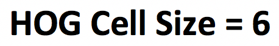
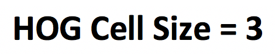
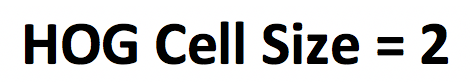

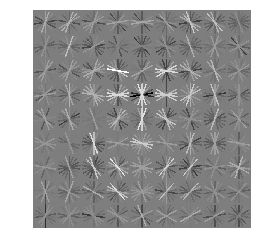
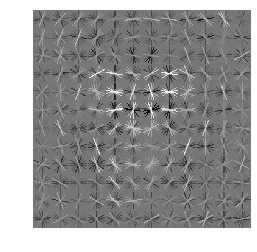
</td>
</tr>
</table>

 HOG cell size of 6 coarsely represent a shape of face. However, making the cell size smaller, represent the faces in detail and it may enhance the performance of a classifier.
 

<h2><B> Learn SVM Classifier</B></h2>

 Using the features from previous step, SVM classifier is trained to detect faces from non-faces. In this part, two classifiers are trained. The first one simple trained on all of the features from previous step. 10,000 negative features are used to train this classifier. After training the first classifier, training set is examined again to mine hard negatives. Hard negatives are the features which are misclassified as faces. Therefore, the second classifier would be trained with false positives. Similar to the initial classifier, 10,000 negative features are extracted to train this classifier. 

 Accuracy of SVM classifier on training data, when all features are used, is equal to 99.881%. Figure below shows how well this separates the positive and negative examples at training time. Note that, HOG cell size of 6, template size of 36 and regularization constant of 0.05 are used to train this classifier. 

<table border=0.5>
<tr>
<td>
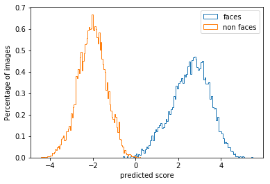
</td>
</tr>
</table>

<h3><B>Run Detector</B></h3>

 In this part of the project, new images are examined to test the classifier. Sliding window technique is used to extract all of the features from an image and pass it to classifier. Windows with a confidence of higher than a threshold are called faces. Then, 200 most confident features are passed to non-maximum suppression algorithm.

 As the first step, features are extracted in single scale. Accuracy in this step was 38.3%. To reach higher precision accuracy, we should look at the features in different scales. We change the scale of the image as a function of rescale factor. A power of rescale factor is set change the scale of the original image. This is done in way that the smallest rescaling occurs in 0.2 scale. Using this algorithm, accuracy increased to 83.8%. Results are shown below. 

<table border=0.5>
<tr>
<td>
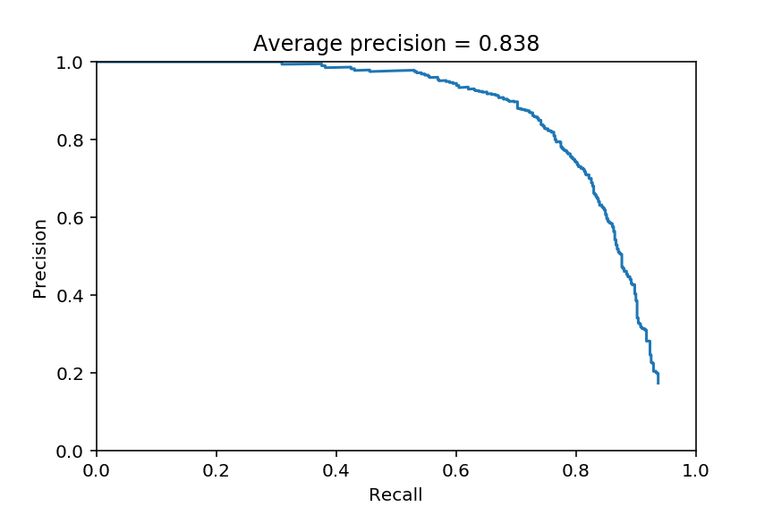
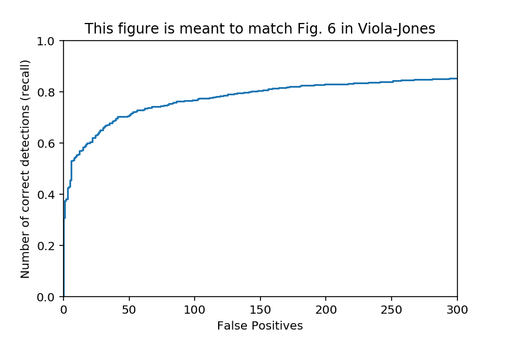
</td>
</tr>
</table>

 The classifier which is trained with hard features increases the accuracy slightly to 83.9%. 

<h3><B>Parameter Optimization</B></h3>

 The performance of face detection algorithm could be further improved by optimizing some important hyperparameters. The first one is the regularization parameter in SVM classifier. Due to figure below, the best accuracy for test dataset achieves when  C = 0.01. Higher regularization parameters have higher training performances but it seems that it overfits to the data since the test accuracy is lower for that. On the other hand, setting small values to regularization parameter makes the final boundaries too liberal and classifier is not able to do a descent job both in training and test datasets. So, we set C to be 0.01 for rest of this project. 

<table border=0.5>
<tr>
<td>
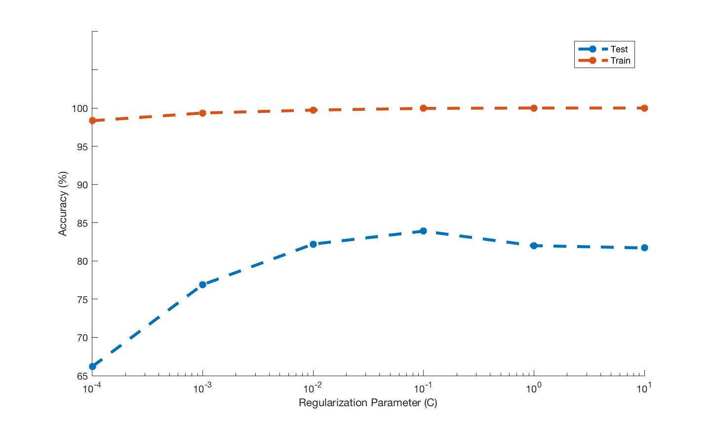
</td>
</tr>
</table>

 Two important parameters are number of negative examples and rescale factor. I change these parameters at the same time since conceptually both of them help the algorithm to be exposed to more examples. We started with 10,000 examples and rescale factor of 0.8. Increasing number of negative examples to 50,000  and change the rescale factor to 0.9 improves the accuracy to 85.1% because simply it trains the classifier with more examples and finally test the new images in finer detail. Using this classifier and mining 10,000 hard negatives will even perform better in terms of accuracy and 85.6% of test examples were classifies correctly. Note that, still 200 most confident features are passed to non-maximum suppression.

 In final step, we change the HOG cell size which mentioned in the beginning of this writeup. Smaller HOG cell sizes improves the accuracy to great extend, but at the expense of time. It increases the running time from about 2 minutes to more than 10 minutes. However, it increases the accuracy to 89.1%. Further passing of examples (500) to non-maximum suppression improved the accuracy to 90.6%. 

<table border=0.5>
<tr>
<td>
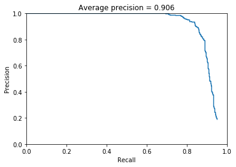
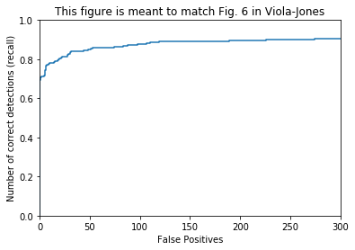
</td>
</tr>
</table>

 Below you can see some examples of face detection, using HOG cell size of 6, template size of 36, regularization parameter of 0.01, rescale factor of 0.9, 50,000 non-face training examples, and 300 top confident features passed to non-maximum suppression. 

<table border=1>
<tr>
<td>

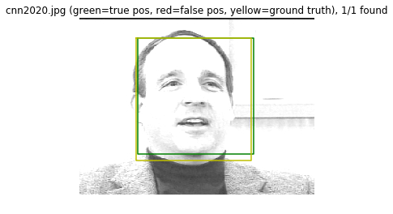
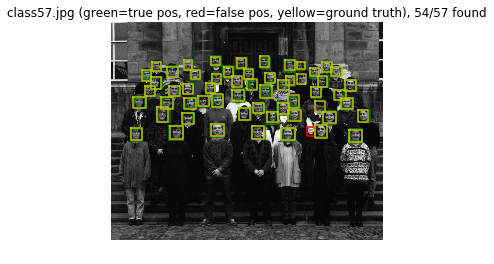
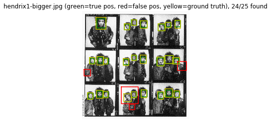
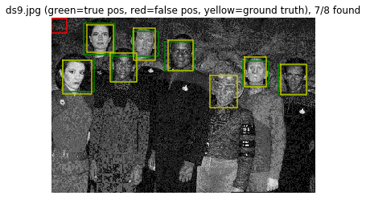
</td>
</tr>

<tr>
<td>

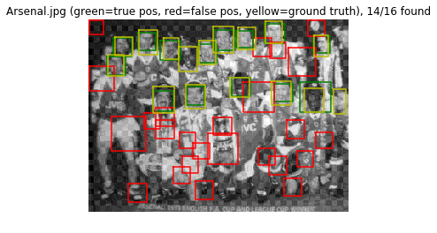
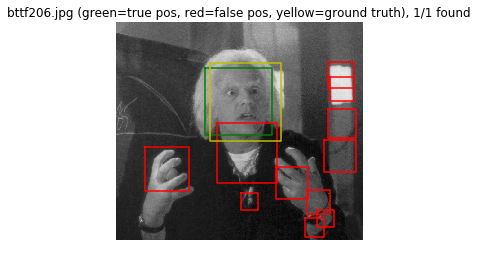
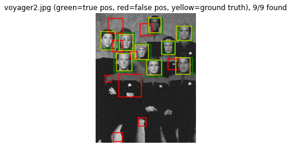

</td>
</tr>

<tr>
<td>
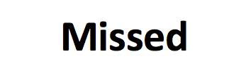
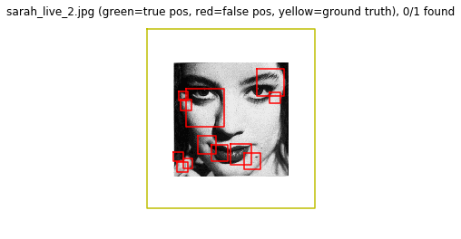
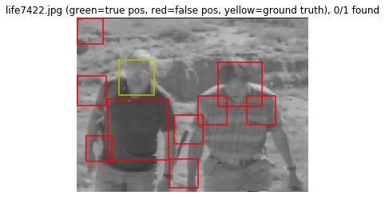
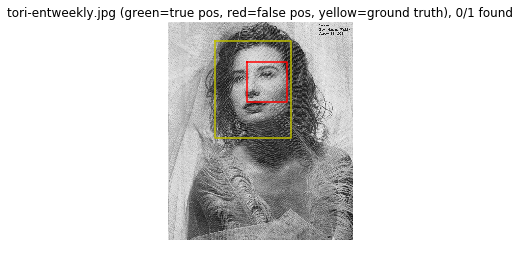
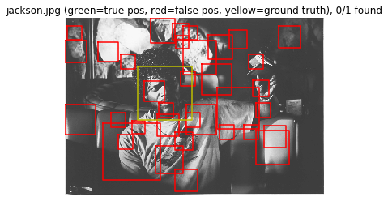
</td>
</tr>

</table>

<h3><B>Face Detection on Extra Scenes</B></h3>

<table border=0.5>
<tr>
<td>
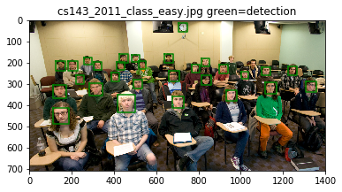
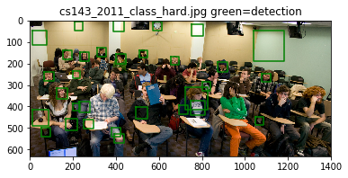
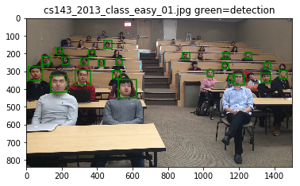

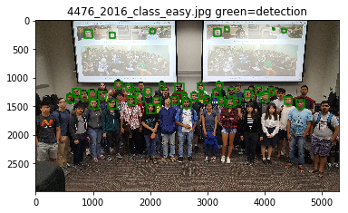
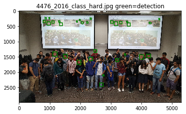
</td>
</tr>
</table>

<h3><B>Conclusions</B></h3>

 Face detection is examined using SIFT-like histograms to extract features of images along with SVM classifier. The most important factor in this project is parameter optimization. In fact this method is very easy algorithm to implement but it is carefully engineered. One of the important parameters is HOG cell size. Smaller cell sizes tend to work better for face detection because they extract the features in more details but at expense of running time. Also, number of training data is very important. In this project, increasing the number of non-face features to train the classifier improved the performance. So, this is very important to have enough data to run classification on a dataset.

 Other important factor is the number of detected points that we pass to non-maximum suppression. Generally, that is the number of features algorithm decide as to be a face. Increasing this number, increases the accuracy to great extend, but this increases the number of false positives as well. Actually, one way to improve this algorithm is to find a way to further examine the final decisions and discriminate the faces vs. non-faces. 

 Finally, rescale factor on test images and classifier parameters e.g. regularization parameter are the ones which should be optimized. Rescale factor helps algorithm to find the face-like features in all scales which could be critical in face detection in real world images. Besides, classifier parameters should be optimized to both avoid overfitting and underfitting the data. 

 The final point is that, one could improve the performance of the classifier by training it with "hard" images. It means that to train the classifier with images which are more similar to faces in classifier's perspective. This in turn slightly enhanced the performance of face detection in this project. 

</body>
</html>
