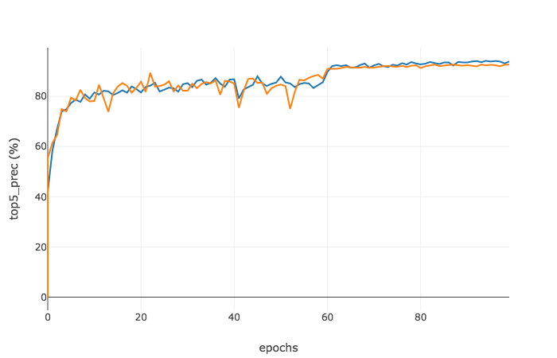

<!-- <html>
<head>
<title>Computer Vision Project</title>
<link href='http://fonts.googleapis.com/css?family=Nunito:300|Crimson+Text|Droid+Sans+Mono' rel='stylesheet' type='text/css'>
<link rel="stylesheet" title="Default" href="styles/github.css">

<link rel="stylesheet" href="highlighting/styles/default.css">

</head>
<body>

<h1><B>Farshad Rafiei</B></h1>

 -->

<h2><B> Project 6: Deep Learning </B></h2>

AlexNet / VGG-F network visualized by mNeuron.

 This project examines deep learning as a tool for computer vision applications. Specifically, the goal of this project is to design and train deep convolutional networks for scene recognition purposes. We are going to follow three main steps: 

<li>Part 0: train a simple network from scratch</li>
<li>Part 1: improving network performance from part 0 by adding pre-processing steps such as jittering, flipping and normalization as well as modifying the network by adding dropout, batch normalization and more layers. </li>
<li>Part 2: fine-tune a pre-trained deep network (AlexNet) and compare it's performance with the network from part 1</li>

<h2><B> Part 0 </B></h2>
<h3>What is deep learning?</h3>

 	The idea behind deep learning comes from the hierarchical learning process in human brain. Mathematically, deep structure is a multi-layer neural network with hierarchy of increasing complexity and abstraction. Deep learning as a method learns to provide appropriate weights to distinct features by adjusting weights of layers in its network for the task at hand. It's all done automatically which in basic sense is all multiplication and additions that start off with random values stabilizing to certain values that leads to best possible results. 

 As much as it was black box earlier, increasing interest in understanding deep networks have shown that each layer gradually learns to add up the information to recognize and predict. These information which isn't necessarily need to be extracted and feed as in traditional (machine) learning is what makes deep learning powerful and automatic. And so deep learning has eroded a lot of manual feature engineering given a respectable size of dataset. 

<h3> Train a baseline network from scratch </h3>

 In this part we are going to train a baseline network with 4 layers. It's structure starts with a convolutional layer, following with a max pooling layer and a rectified linear layer. The last layer is a convolutional layer which is called fully connected layer. At the top of the network there is a loss layer which measures the degree to which a the network perform for any input. Using derivative of loss function along with backpropagation algorithm, network weights will be updated for each training batch. 

 The performance of this network for our scene recognition problem reaches the accuracy of 36.382%. Performance of the network is shown in the following figures. 

<table border=1>
<tr>
<td>

</td>
</tr>
</table>

 The left panel shows training loss (blue) and validation loss (dashed orange). As expected, there should be a monotonically decreasing trend in loss for training data. However, loss incurred on the held out validation set directly depends on the generalization of model. Pass through the validation set does not change the weights in network and it only is used to examine the model performance. 

 The middle and right panel shows top 1 and top 5 precision respectively. As the backpropagation decreases the loss by updating weights in each epoch, training error decreases (not monotonically though), but the performance on validation set saturates and it can not perform better than <B>36.382%</B> on top 1 accuracy. 

<h2><B> Part 1 </B></h2>
<h3>Pre-processing</h3>

 <B>Jittering: </B>Deep learning is the state of the art algorithm these days which need a large amount of data to perform decently for the desired task. In fact, without having a large dataset, old algorithms could work equally well and in some cases when features are being engineered well enough, they could even beat deep structures in terms of performance. In our scene recognition problem, we only posses 1500 images which is not enough for training a deep structure. one way to increase the training data is to horizontally mirror images. This will not change the context of the image, since a category will not be changed after a right-left flipping. Therefor, jittering would be a good pre-processing step to increase the performance of the baseline network. Figures below show the performance of the network after adding "jittering" to the data. In this case, there will be 3000 images which is better than training with 1500 images, but not better than training with 3000 completely independent samples.   

<table border=1>
<tr>
<td>

</td>
</tr>
</table>

 The top 1 accuracy increases to <B>44.054%</B> after jittering the original dataset. Figures above show that the training and validation error decrease slower than previous architecture. This is because of larger number of images we now have to train the network. 

 <B>Normalization: </B> CNNs learn their weights by continually adding gradient error vectors (multiplied by a learning rate) computed from backpropagation to various weight matrices throughout the network as training examples are passed through. If we didn't scale our input training vectors, the ranges of our distributions of feature values would likely be different for each feature, and thus the learning rate would cause corrections in each dimension that would differ (proportionally speaking) from one another. We might be over compensating a correction in one weight dimension while undercompensating in another. This is non-ideal as we might find ourselves in a oscillating (unable to center onto a better maxima in cost(weights) space) state or in a slow moving (traveling too slow to get to a better maxima) state. Figures below show the performance of the network after normalizing the images. Note that the images are being normalized with subtracting the mean from training examples and divide them by their standard deviation. 
 

<table border=1>
<tr>
<td>

</td>
</tr>
</table>

 The best top 1 accuracy for this part is <B>51.223%</B>. As it could be seen from above figures, the error falls very fast in few first epochs. This shows the importance of simple and effective pre-processing step in this part (normalization).

<h3>Network strructure</h3>

 <B>Regularization: </B> Figures above show that network has learn weights which can perfectly recognize the training data, but those weights does not generalize to the validation data. In this case, the best solutions is to provide more data as regularization. But here we only have 1500 images (which turned to 3000 after jittering). Another way of doing regularization to avoid overfitting to the train data, is to use dropout regularization. This method turns off network connections randomly which consequently prevents a unit in one layer from relying too strongly on a single unit in previous layer. In fact, random dropout breaks up the adaptation of model to train data by making the presence of any particular hidden unit unreliable. Following figures show the performance of network after adding dropout layer with dropout rate of 0.5 to the baseline network.  

<table border=1>
<tr>
<td>

</td>
</tr>
</table>

 The top 1 accuracy increases to <B>59.765%</B> after this step. To check for the effect of adding dropout layer to our CNN, one can point to the close similarity of performance on both training and validation set. Figures show that gap between top 1 training precision and validation precision (which was very huge in previous steps) is now faded out and it clearly show the generalization of model on validation set. 

 <B>Deep network: </B> To this point, we have not developed a deep architecture yet. We only have one one convolutional layer at the bottom of the network and then maximum response is taken from a 7x7 block and then rectified linear layer zeros out the negative values. Fully connected layer performs as a classifier and learns 15 linear classifiers on a 8x8 filter response map. We will use a deep structure in this step to improve the performance of our scene recognition algorithm. 

 To make the network deeper, I have added a convolutional layer, max pooling layer and ReLu layer to baseline network. To make the network perform well on our scene recognition problem, the parameters are tuned in way that we get accuracy higher than 50%. Structure of the new deep network is as following: 

features:

<li><B>(1)</B> Convolutional layer (output channels = 10, kernel size = 5, stride = 1, padding = 0)</li>
<li><B>(2)</B> Max pooling (kernel size = 5, stride = 3, padding = 0)</li>
<li><B>(3)</B> Rectified linear unit</li>
<li><B>(4)</B> Convolutional layer (output channels = 15, kernel size = 3, stride = 1, padding = 0)</li>
<li><B>(5)</B> Max pooling (kernel size = 3, stride = 2, padding = 0)</li>
<li><B>(6)</B> Rectified linear unit</li>
<li><B>(7)</B> Dropout layer (p = 0.5)</li>

classifier:

<li><B>(8)</B> Convolutional layer (output channels = 15, kernel size = 8, stride = 1, padding = 0)</li>

 With this structure, the top 1 accuracy is equal to <B>58.626%</B>. Figures below show the performance of the deep network for our scene recognition problem. 

<table border=1>
<tr>
<td>

</td>
</tr>
</table>

 Note that keeping the parameters from baseline network decreases the accuracy to great extent. It has two major reasons. First of all, the kernel size of first layer is equal to 9 which is relatively high for our images. I reduced the kernel size for first layer to account for more detailed information in our images. Second, max pooling operation in baseline network covers a window of 7x7 and then is subsampled with a stride of 7 which is overly lossy. Hence, we needed to tune our parameters in our new network. 

 <B>Batch normalization: </B> To increase the stability of a neural network, batch normalization normalizes the output of a previous activation layer by subtracting the batch mean and dividing the batch standard deviation. In fact, batch normalization allows each layer of network to learn by itself a little bit more independently of other layers. By using batch normalization and tuning the parameters again, the structure of the network becomes as figure below: 

features:

<li><B>(1)</B> Convolutional layer (output channels = 10, kernel size = 5, stride = 1, padding = 0)</li>
<li><B>(2)</B> Batch normalization (number of features = 10)
<li><B>(3)</B> Max pooling (kernel size = 5, stride = 3, padding = 0)</li>
<li><B>(4)</B> Rectified linear unit</li>
<li><B>(5)</B> Convolutional layer (output channels = 10, kernel size = 3, stride = 1, padding = 0)</li>
<li><B>(6)</B> Batch normalization (number of features = 10)
<li><B>(7)</B> Max pooling (kernel size = 3, stride = 2, padding = 0)</li>
<li><B>(8)</B> Rectified linear unit</li>
<li><B>(9)</B> Dropout layer (p = 0.5)</li>

classifier:

<li><B>(10)</B> Convolutional layer (output channels = 15, kernel size = 8, stride = 1, padding = 0)</li>

 First convolutional layer compute the output of neurons that are connected to local regions with size 5x5 in the input, each computing a dot product between their weights and and a small region they are connected to in the input volume. These weights are the ones being learned. They are initialized with random numbers from Gaussian distribution and this will result in 10 different channels (or simply images) in the output. batch normalization will normalize the output of convolutional layer. Pooling layer will perform a downsampling operation and along the spatial dimensions. It will take the max over a 5x5 sliding window and then subsample it the resulting map with a stride of 3. The filter depth will remain the same after this step. Next layer is rectified linear unit which applies an element-wise activation function which applies non-linearity to the system. Any negative value in the output of the previous layer will be set to zero and all other ones will remain unchanged. feature extraction continues with another convolutional layer, this time with smaller spatial span (3x3) to extract more information from images. Similar to previous convolutional layer, the output of this layer has depth of 10. This layer is followed by a batch normalization layer to stabilize the network while backpropagation. Another max pooling layer downsamples the output channels with ratio of 3 and ReLu layer will apply the non-linearity to it. The next layer is dropout layer. This layer avoids the network to overfit to the train data by removing half of the connections randomly and learn the weights without considering them. The last layer is fully connected layer which compute the class scores, resulting in 15 numbers.  Filter dimension for this layer is 8x8 and this is the only filter size that will result in 15 category scores in the output. Performance of this deep network is shown in figure below. 

<table border=1>
<tr>
<td>

</td>
</tr>
</table>

The top 1 precision increases to <B>62.613%</B> using the above structure. Performance is shown in the figures below. Notice that the network tends to reach higher accuracies in a few first iterations. This clearly shows the effect of adding batch normalization to the network. 

 <B> Learning rate: </B> Learning rate is a hyper-parameter that controls how much we are adjusting the weights of our network with respect to the loss gradient. The lower the value, the slower we travel along the downward slope.  Till now, we have used learning rate of 1e-2 in all of the structures we used. But we never talked about the effect of changing learning rate on performance of the algorithm. Especially after batch normalization, we see a trend of fast stabilization. Effect of changing learning rate is shown in figure below. 

<table border=1>
<tr>
<td>

</td>
</tr>

<tr>
<td>

</td>
</tr>

<tr>
<td>

</td>
</tr>

<tr>
<td>

</td>
</tr>

</table>

 Network performance is very sensitive to even very slight changes in learning. This can be drawn from looking at the first two rows of above figure. Learning rate changes from 1e-1 to 5e-2 and you can see the first structure have a very hard time converging to local minima. Overall, loss should show a decreasing trend when appropriate learning rate is used, but it should not be too low that you never see convergence. This is obviously shown in bottom two figures which indicates that the best learning rate is around 1e-2. The highest precision is acquired when we used LR = 1e-2. 

<h2><B> Part 2 </B></h2>

 Instead of training a network from scratch, in this part, we will use a pre-trained network called AlexNet. In fact, one of the impressive aspects of the representations used  learned by deep convolutional networks is that they generalize surprisingly well to recognition tasks. This is unexpected because one may expect that these networks should overfit to the data they have already learned. However, they show a good generalization when used in a new domain. To examine whether AlexNet could be generalized to our scene recognition problem, we will use fine-tuning strategy. 

 In this strategy, a pre-trained network is taken and the final layer (or more) is replaced with random weights. Then, the new network is trained again with new sets of images. In fact, the only initial change in the network, is the change in classifier layers, not in feature representation and the already learned filters in pre-trained network is being treated as a good initialization than a random initialization.

 Here we have 15 categories, but AlexNet is trained for 1000 categories. So, the only change is to take the last layer, assign initial weights to it and change the output depth to 15. This is a slow process to train this network on our images, but we do not need more than 4 epochs to reach accuracy higher than even 85%. Performance is shown in figure below.

<table border=1>
<tr>
<td>

</td>
</tr>
</table>

 Top 1 accuracy is <B>86.064%</B> using fine-tuned AlexNet for our scene recognition problem. 

<h3> <B>Conclusions </B></h3>

 We examined two methods to solve our scene recognition problem using deep learning. In the first method we trained a network from scratch. Despite the fact that we used different tricks, the results were not very satisfying since we did not have large amount of data to train this network. We used jittering to double our dataset to overcome this issue. It improved the results a little bit. Also, we used normalization as a pre-processing step to avoid abrupt changes while backpropagation. We used dropout layer in network structure to avoid overfitting and batch normalization to stabilize the training process. We tuned hyperparameters in our deep network and reached the accuracy of <B>62.613%</B> in 100 epochs with an appropriate learning rate. We showed that small learning rates will not converge to a local minima and on the other hand, objectives remain constant over all epochs using large learning rates.	

 In the second method, we take a pre-trained network (AlexNet) and fine-tuned it to our data by only adjusting the last layer parameters to our data. We then trained this network to learn new weights for our dataset. The accuracy reached <B>86.64%</B> in only 4 epochs with this strategy which outperforms the previous method. This shows that these networks are generalizable and easy to tune to new dataset. However, deep learning should be used in cases where there is a large dataset and without having a large bank of data, hand-crafted feature representations and engineered processes could beat deep neural networks (like what we saw in project 4).

</body>
</html>
